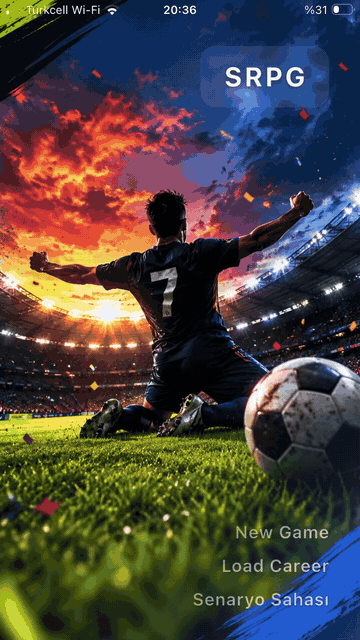
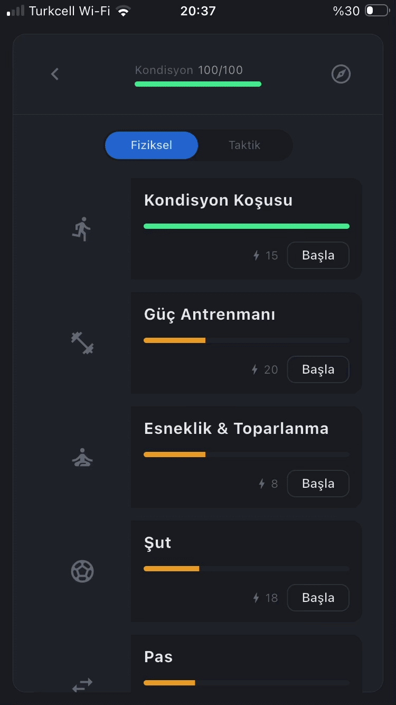
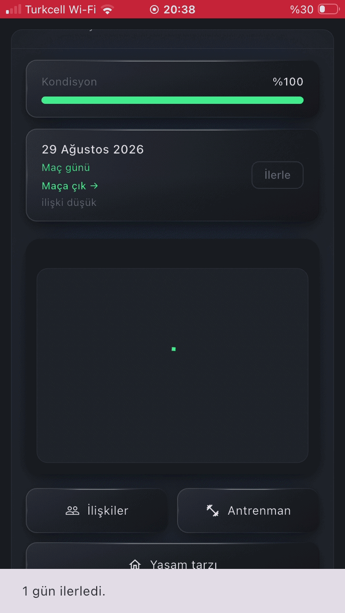
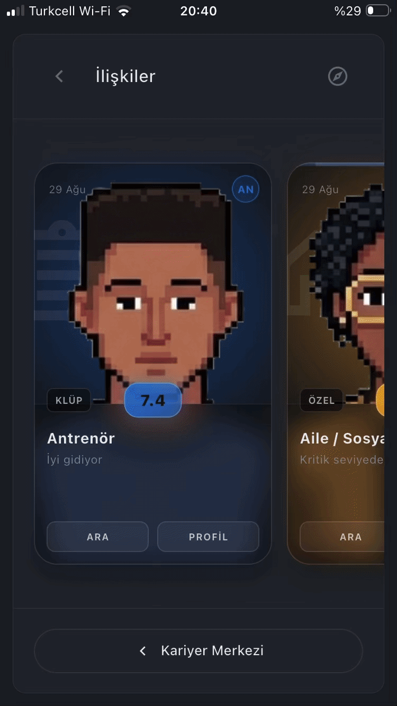
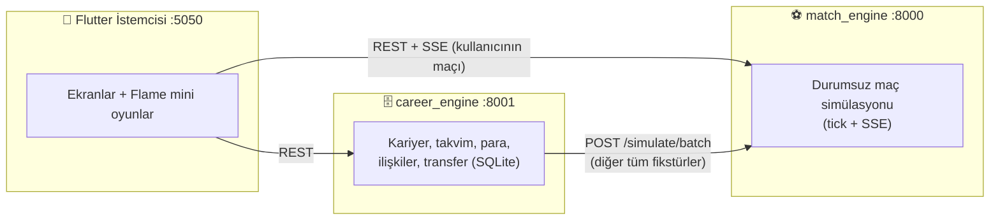

<div align="center">

# ⚽ ProjectSRPG

### Bir futbolcunun kariyerini sen yönet — antrenmandan transfere, sosyal hayattan maç anındaki kararlara kadar.

[](https://flutter.dev)
[](https://www.python.org)
[](https://fastapi.tiangolo.com)
[](https://sqlite.org)
[](https://www.blender.org)


[🎮 Oyun](#-oyun-neler-sunuyor) · [🏗️ Mimari](#%EF%B8%8F-mimari) · [🚀 Kurulum](#-kurulum) · [🧪 Test](#-test) · [📜 Sözleşmeler](#-sözleşmeler-önce-gelir) · [🗺️ Yol Haritası](#%EF%B8%8F-yol-haritası)

</div>

---

<p align="center">
  
</p>

## 🎮 Oyun Neler Sunuyor?

ProjectSRPG, **futbolcu kariyeri** odaklı bir strateji-RPG'dir. Tek bir oyuncuyu yaratırsın; sahada ve saha dışında verdiğin her karar, kariyerinin yönünü değiştirir.

<table>
<tr>
<td width="50%" valign="top">

### 🏋️ Antrenman Mini Oyunları
Her yetenek, kendi mini oyunuyla gelişir: bench press, kondisyon, esneklik, top sürme, müdahale (tackle) ve beceri sınavları. Antrenman **kondisyonu tüketir** — her gün neyi çalışacağın bir bütçe meselesidir.



</td>
<td width="50%" valign="top">

### ⚽ Maç Günü
Maç `match_engine` ile canlı simüle edilir (SSE akışı). Kritik anlarda oyun duraklar ve **sana karar verir**: şut mu, pas mı, müdahale mi? Seçimin bir mini oyuna dönüşür ve sonucu etkiler.



</td>
</tr>
<tr>
<td width="50%" valign="top">

### 🤝 İlişkiler ve Diyaloglar
Hocan, takım arkadaşların, menajerin, ailen… Her karakterin bir **skoru ve karakter özellikleri** var. Diyalog ekranlarında sahneye uygun arka planlar, prosedürel yüzler ve daktilo efektli konuşmalar karşılar seni.



</td>
</tr>
</table>

### ✨ Öne Çıkan Özellikler

| | Özellik | Açıklama |
|---|---|---|
| 📅 | **Takvim ve zaman döngüsü** | Gün gün ilerleyen dünya; her gün bir *gün bütçesi* harcanır |
| 🧑‍🏫 | **Antrenör konuşması → güven → kadro** | Hocanla ilişkin, ilk 11'de mi yoksa yedekte mi olacağını belirler |
| 🏆 | **Lig, sezon ve devir** | Sezon sonu terfi/düşme, sözleşme bitişi ve yeni kulüp teklifleri |
| 🎽 | **Beceri ve ekipman** | Sosyal beceriler, derecelendirilmiş eşyalar, ev ve yatırım kalemleri |
| 🎲 | **Riskli sosyal etkinlikler** | Davetler, çatışmalar, ertelenmiş sonuçlar ve tetikleyici kuyruğu |
| 📰 | **Haber akışı** | Dünyada olanlar ve senin başardıkların manşete çıkar |
| 📱 | **Çevrimdışı mobil** | iOS'ta iki Python motoru uygulamanın *içinde* çalışır — internet gerekmez |


---

## 🏗️ Mimari

Proje **üç süreçten** oluşur. Her birinin tek bir sorumluluğu vardır:



| Süreç | Konum | Port | Sorumluluğu |
|---|---|---|---|
| 🎨 **Flutter istemcisi** | `lib/`, `test/` | `5050` | Tüm sunum katmanı; kullanıcının maçını iki back-end arasında taşır |
| 🗄️ **career_engine** | `career_engine/` | `8001` | Kalıcı olan her şey: kariyer, takvim, para, nitelikler, dünya, ilişkiler, transfer, sponsorluk, haberler |
| ⚽ **match_engine** | kardeş repo `../match_engine/` | `8000` | Tek maçlık, durumsuz simülasyon: tick'ler, SSE, müdahale teklifleri |

### 📂 Depo Yapısı

```text
ProjectSRPG/
├── lib/
│   ├── net/        # API istemcileri + modeller (career, match, SSE, money)
│   ├── state/      # PlayerState, MatchController (Provider/Riverpod yok — bilerek)
│   ├── game/       # Flame + saf Dart oyun mantığı (şut, tackle, dribble, antrenman…)
│   ├── screens/    # Her ekran bir dosya
│   ├── widgets/    # Ortak arayüz bileşenleri
│   ├── boot/       # iOS'ta gömülü Python başlatma + açılış ekranı
│   └── theme/      # AppColors
├── career_engine/
│   ├── api/        # FastAPI yönlendiricileri (CONTRACT bölümü başına bir tane)
│   ├── domain/     # İş mantığı — "tek yazma yolu" modülleri
│   ├── catalog/    # Antrenman, mağaza, konut, diyalog katalogları
│   ├── content/    # Üretilen içerik şablonları
│   ├── worlddata/  # Sabit v1 dünyası: takımlar, ligler, pozisyonlar
│   ├── db/         # Numaralı SQL migrasyonları
│   └── tests/      # 692 test
├── tools/
│   ├── blender/    # Sprite, arka plan ve portre üreten Blender betikleri
│   └── phone/      # iOS gömülü Python paketleme hattı
└── assets/         # Üretilmiş görseller ve modeller
```

### 🔒 "Tek Yazma Yolu" Kuralı

Kritik değerlerin tek bir yazarı vardır; böylece defter tutarlılığı garanti altındadır.

| Değer | Tek yazıcı | Değişmez |
|---|---|---|
| 💰 `career_state.money` | `wallet.apply()` | INV-17 |
| ❤️ `relationship.score` | `relationships.apply_delta()` | INV-15 |
| 🧬 `relationship.traits` | `relationships.apply_trait_delta()` | INV-42 |
| 🌟 `player_fame.value` | `fame.apply()` | INV-24 |

Her biri kendi kayıt satırını aynı işlemde yazar; `commit` işini çağıran endpoint yapar, böylece çok adımlı eylemler ya tamamen olur ya hiç olmaz.

---

## 🚀 Kurulum

### Gereksinimler

- 🐦 **Flutter** (Windows'ta SDK `./flutter/` altında hazır gelir)
- 🐍 **Python 3.12**
- ⚽ Kardeş depo **`match_engine`** (`../match_engine/`)

### ⚡ Hızlı Başlangıç (Windows)

```bat
run_all.bat
```

Bu komut iki back-end'i ayrı pencerelerde ayağa kaldırır, ardından Flutter web istemcisini açar. Flutter kapanınca back-end'leri de kapatır.

### 🔧 Elle Başlatma

```bash
# 1) career_engine
cd career_engine
python -m venv .venv
.venv/Scripts/pip install -r requirements.txt
.venv/Scripts/python run_server.py          # http://127.0.0.1:8001
```

```bash
# 2) match_engine (kardeş repo)
cd ../match_engine
python run_server.py                        # http://127.0.0.1:8000
```

```bash
# 3) İstemci
./flutter/bin/flutter run -d web-server --web-port 5050
```

> 💡 `career_engine/career.db` ilk açılışta oluşur. Dünyayı sıfırlamak için dosyayı silmen yeterli.

### 📱 iOS (Çevrimdışı)

iOS'ta iki motor da uygulamanın içinde, gömülü CPython 3.12 üzerinde çalışır (`serious_python`). Paketleme hattının tamamı tek komuttur:

```bash
tools/package_phone.sh
```

Hat sırasıyla şunları yapar: paketi birleştir → masaüstünde duman testi → iOS wheel'leri → hazırla. Açılışta `BootGate`, iki `/health` yanıtı gelene kadar bir açılış ekranı gösterir.

---

## 🧪 Test

```bash
# Flutter widget ve birim testleri
./flutter/bin/flutter test

# Statik analiz
./flutter/bin/flutter analyze lib test
```

```bash
# Back-end (692 test)
cd career_engine && ./.venv/Scripts/python.exe -m pytest -q
```

`tests/test_end_to_end.py`, tüm alanları tek oturumda dolaşır; çapraz değişikliklerden sonra ilk bakılacak testtir.

---

## 📜 Sözleşmeler Önce Gelir

Tüm veri formatlarının tek doğruluk kaynağı iki imzalı sözleşme belgesidir; kod bunlara göre yazılır, tersi değil.

| Belge | Kapsam |
|---|---|
| 📘 [`career_engine/CONTRACT.md`](career_engine/CONTRACT.md) | Kariyer endpoint'leri, SQLite şeması, karar kaydı (D1–D96), değişmezler (INV-1…INV-71), hata kodları |
| 📗 `../API_CONTRACT.md` | match_engine ↔ maç ekranı: tick zarfı, 26 `event_type`, müdahale teklifleri, direktif/efor |

Kod yorumlarındaki `§5.6`, `D38`, `INV-17` gibi atıflar bu belgelere giden köprülerdir. Açık kalan değerler `⟦AÇIK-n⟧` ile işaretlidir.

---

## 🎨 Üretilen Varlıklar

Görsellerin büyük kısmı elle değil, **Blender betikleriyle** üretilir:

| Varlık | Üreten araç |
|---|---|
| 🧍 Oyuncu sprite'ları (8 yön, forma renkleri tint ile) | `tools/blender/build_match_players.py` → `render_match_sprites.py` → `assemble_match_sprites.py` |
| 🌆 Diyalog arka planları (45 sahne) | `tools/blender/build_dialogue_backdrops.py` |
| 🗿 İlişki portreleri (rig'li büstler) | `tools/blender/build_relationship_portraits.py` |


---

## 🗺️ Yol Haritası

- [ ] ⚔️ **Maç içi tetikleyiciler** — kırmızı kart, oyundan çıkma gibi anların ilişki/sosyal olayları doğurması (şu an yalnızca takvim ve maç sonrası tetikleyiciler var)
- [ ] 🎂 Oyuncu yaşının ilerlemesi
- [ ] 🔓 `⟦AÇIK⟧` ile işaretli açık denge değerlerinin kesinleştirilmesi
- [ ] 🤖 Android paketleme

Bilinen eksiklerin güncel listesi için [`career_engine/README.md`](career_engine/README.md) dosyasına bakabilirsin.

---

<div align="center">

**⚽ Sahaya çık, kariyerini yaz. ⚽**

<sub>Flutter · Flame · FastAPI · SQLite · Blender ile yapıldı</sub>

</div>
